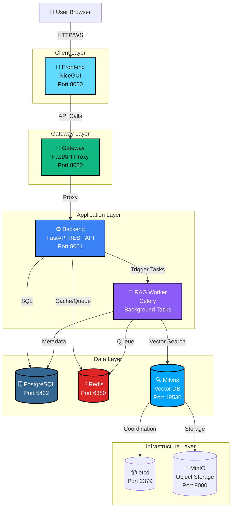
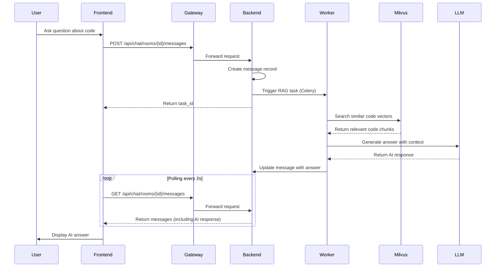
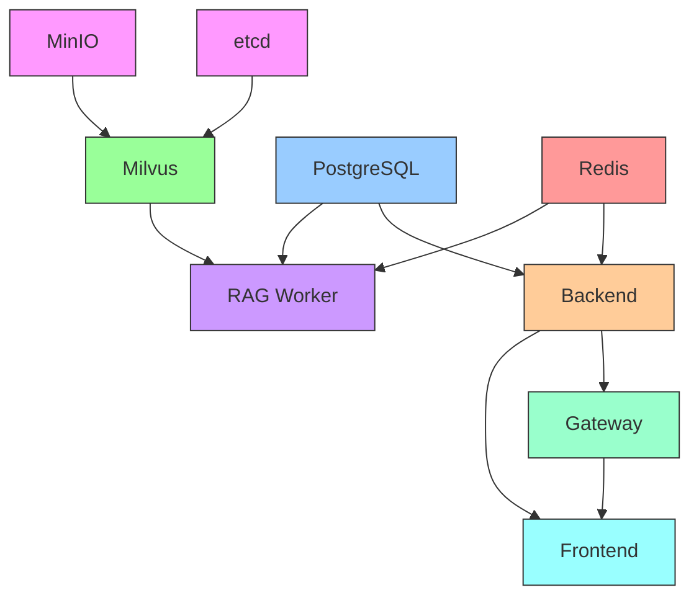

# RAGIT - Retrieval-Augmented Generation with Intelligent Tracking

**RAGIT** is a self-hosted, production-ready RAG (Retrieval-Augmented Generation) system built with microservices architecture. It enables AI-powered code analysis, semantic search, and intelligent chat interactions with your codebase using vector embeddings and LLM integration.

## 🚀 Overview

RAGIT is designed to help developers understand and navigate large codebases through AI-powered semantic search and conversational interfaces. By combining vector databases with Large Language Models, RAGIT provides context-aware answers to questions about your code.

### Key Features

- **🏗️ Microservices Architecture**: Scalable Gateway-Backend pattern with service isolation
- **🔍 Semantic Code Search**: Vector-based code retrieval using Milvus
- **💬 AI-Powered Chat**: LLM integration for natural language code queries
- **📦 Fully Dockerized**: 9 containerized services for easy deployment
- **⚡ Async Processing**: Celery-based background workers for heavy computations
- **🎨 Modern Web UI**: Beautiful, responsive interface built with NiceGUI
- **🔐 Authentication & Authorization**: Secure user management with JWT tokens
- **📊 Real-time Updates**: WebSocket-like polling for chat synchronization

---

## 📋 Table of Contents

- [Architecture](#-architecture)
- [System Components](#-system-components)
- [Docker Services](#-docker-services)
- [Communication Flow](#-communication-flow)
- [Project Structure](#-project-structure)
- [Video Tutorial](#-video-tutorial)
- [Getting Started](#-getting-started)
- [Port Configuration](#-port-configuration)
- [Technology Stack](#-technology-stack)

---

## 🏛️ Architecture

RAGIT follows a **microservices architecture** with clear separation of concerns. The system consists of 9 Docker containers working together to provide a seamless RAG experience.

### High-Level Architecture Diagram



### Detailed Data Flow



---

## 🧩 System Components

### 1. **Frontend Service** (NiceGUI)
- **Port**: 8000
- **Purpose**: Web UI for user interaction
- **Features**:
  - Repository management interface
  - Real-time chat interface
  - User authentication pages
  - Settings and configuration
- **Tech**: Python, NiceGUI, Tailwind CSS

### 2. **Gateway Service** (FastAPI)
- **Port**: 8080
- **Purpose**: API Gateway and reverse proxy
- **Features**:
  - Request routing and load balancing
  - CORS handling
  - Request/response transformation
  - Middleware for logging and monitoring
- **Tech**: FastAPI, Python

### 3. **Backend Service** (FastAPI)
- **Port**: 8001
- **Purpose**: Core business logic and REST API
- **Features**:
  - User authentication & authorization (JWT)
  - Repository CRUD operations
  - Chat room management
  - Message persistence
  - Celery task orchestration
- **Tech**: FastAPI, SQLAlchemy, PostgreSQL

### 4. **RAG Worker** (Celery)
- **Purpose**: Asynchronous background processing
- **Features**:
  - Code parsing and embedding generation
  - Vector database operations
  - LLM integration for answer generation
  - Repository analysis and indexing
- **Tech**: Celery, Python, OpenAI API
- **Concurrency**: 2 workers

### 5. **PostgreSQL**
- **Port**: 5432
- **Purpose**: Primary relational database
- **Stores**:
  - User accounts and sessions
  - Repository metadata
  - Chat rooms and messages
  - File tracking information

### 6. **Redis**
- **Port**: 6380 (exposed), 6379 (internal)
- **Purpose**: Cache and message broker
- **Uses**:
  - Celery task queue
  - Celery result backend
  - Session cache
  - Real-time data cache

### 7. **Milvus** (Vector Database)
- **Ports**: 19530 (gRPC), 9091 (metrics)
- **Version**: v2.4.15
- **Purpose**: Vector storage and similarity search
- **Features**:
  - Code embedding storage
  - Semantic code search
  - High-performance vector indexing
  - Scalable architecture

### 8. **etcd**
- **Port**: 2379
- **Purpose**: Distributed configuration for Milvus
- **Role**: Metadata storage and service coordination for Milvus

### 9. **MinIO**
- **Ports**: 9000 (API), 9001 (Console)
- **Purpose**: Object storage backend for Milvus
- **Role**: Stores vector data and logs for Milvus

---

## 🐳 Docker Services

RAGIT runs **9 Docker containers** in a coordinated network:

| Service | Container Name | Image | Exposed Ports | Internal Ports | Health Check |
|---------|---------------|-------|---------------|----------------|--------------|
| PostgreSQL | ragit-postgres | postgres:15 | 5432 | 5432 | ✅ pg_isready |
| Redis | ragit-redis | redis:7-alpine | 6380 | 6379 | ✅ redis-cli ping |
| etcd | ragit-etcd | quay.io/coreos/etcd:v3.5.5 | - | 2379 | ✅ endpoint health |
| MinIO | ragit-minio | minio/minio:RELEASE.2023-03-20T20-16-18Z | 9000, 9001 | 9000, 9001 | ✅ health endpoint |
| Milvus | ragit-milvus | milvusdb/milvus:v2.4.15 | 19530, 9091 | 19530, 9091 | ✅ /healthz |
| Backend | ragit-backend | ragit-backend (custom) | 8001 | 8001 | ✅ /health |
| Gateway | ragit-gateway | ragit-gateway (custom) | 8080 | 8080 | ✅ root endpoint |
| Frontend | ragit-frontend | ragit-frontend (custom) | 8000 | 8000 | ✅ root endpoint |
| RAG Worker | ragit-rag-worker | ragit-rag-worker (custom) | - | - | ⚙️ Celery inspect |

### Service Dependencies



---

## 🔄 Communication Flow

### Request/Response Flow

1. **User Interaction**
   - User accesses web UI at `http://localhost:8000`
   - Frontend renders NiceGUI components

2. **API Gateway Pattern**
   - Frontend sends API requests to Gateway (`http://localhost:8080`)
   - Gateway validates, transforms, and forwards to Backend (`http://localhost:8001`)

3. **Business Logic Processing**
   - Backend processes requests using FastAPI routers
   - Authenticates users via JWT tokens
   - Queries PostgreSQL for structured data

4. **Asynchronous RAG Processing**
   - Backend creates Celery tasks for RAG operations
   - Tasks are queued in Redis
   - RAG Worker picks up tasks from the queue
   - Worker performs vector operations on Milvus
   - Worker calls OpenAI API for LLM responses
   - Results are stored back in PostgreSQL

5. **Real-time Updates**
   - Frontend polls Backend every 2 seconds
   - Backend returns updated chat messages
   - UI automatically displays new AI responses

### Internal Service Communication

```
Frontend ←→ Gateway ←→ Backend
                ↓
            PostgreSQL
                ↓
            Celery Tasks (via Redis)
                ↓
            RAG Worker
                ↓
        ┌───────┴───────┐
        ↓               ↓
    Milvus          OpenAI API
    (Vector DB)     (LLM)
```

---

## 📁 Project Structure

```
RAGIT/
├── backend/                     # FastAPI REST API Server
│   ├── core/
│   │   ├── database.py          # Database connection & ORM setup
│   │   └── celery.py            # Celery integration
│   ├── models/
│   │   ├── user.py              # User & session models
│   │   ├── repository.py        # Repository models
│   │   ├── chat.py              # Chat & message models
│   │   └── vector.py            # Vector metadata models
│   ├── routers/
│   │   ├── auth.py              # Authentication endpoints
│   │   ├── repository.py        # Repository CRUD endpoints
│   │   └── chat.py              # Chat & messaging endpoints
│   ├── services/
│   │   ├── auth_service.py      # JWT authentication logic
│   │   ├── user_service.py      # User management
│   │   ├── repository_service.py # Repository operations
│   │   └── chat_service.py      # Chat operations
│   ├── schemas/                 # Pydantic request/response models
│   ├── Dockerfile               # Backend container image
│   └── main.py                  # FastAPI application entry
│
├── frontend/                    # NiceGUI Web Interface
│   ├── src/
│   │   ├── components/
│   │   │   └── header.py        # Reusable header component
│   │   ├── pages/
│   │   │   ├── auth_page.py     # Login/Register page
│   │   │   ├── main_page.py     # Dashboard
│   │   │   ├── chat_page.py     # Chat interface
│   │   │   └── repository_settings_page.py
│   │   ├── services/
│   │   │   ├── api_service.py   # Backend API client
│   │   │   └── auth_service.py  # Frontend auth handler
│   │   └── utils/
│   │       └── theme.py         # UI theme configuration
│   ├── Dockerfile               # Frontend container image
│   └── main.py                  # NiceGUI application entry
│
├── gateway/                     # API Gateway Service
│   ├── routers/
│   │   └── auth.py              # Auth proxy routes
│   ├── services/
│   │   ├── proxy_service.py     # Request forwarding logic
│   │   └── data_service.py      # Data transformation
│   ├── config.py                # Gateway configuration
│   ├── Dockerfile               # Gateway container image
│   └── main.py                  # FastAPI gateway entry
│
├── rag_worker/                  # Celery Background Worker
│   ├── vector_db/
│   │   ├── service.py           # Milvus connection & ops
│   │   ├── embedding_service.py # Text → Vector conversion
│   │   ├── search_service.py    # Semantic search
│   │   └── repository_embedder.py # Code embedding pipeline
│   ├── python_parser/
│   │   ├── parser.py            # AST-based code parser
│   │   ├── file_scanner.py      # Repository file scanner
│   │   └── service.py           # Parsing orchestration
│   ├── git_service/
│   │   └── exceptions.py        # Git operation handlers
│   ├── ask_question/
│   │   └── types.py             # LLM integration types
│   ├── tasks.py                 # Celery task definitions
│   ├── celery_app.py            # Celery app configuration
│   ├── Dockerfile               # Worker container image
│   └── main.py                  # Worker entry point
│
├── ragit_sdk/                   # CLI Management Tool (Legacy)
│   ├── core/
│   │   ├── process_manager.py   # Local process management
│   │   └── docker_manager.py    # Docker operations
│   ├── cli.py                   # Click-based CLI
│   ├── config.py                # Configuration management
│   └── logger.py                # Logging utilities
│
├── milvus/                      # Milvus configuration
│   └── embedEtcd.yaml           # etcd settings
│
├── docs/                        # Documentation
│   ├── installation.md
│   ├── sdk-usage.md
│   └── README.md
│
├── data/                        # Runtime data (git ignored)
├── repository/                  # Cloned repositories (git ignored)
├── parsed_repository/           # Parsed code cache (git ignored)
├── logs/                        # Application logs (git ignored)
│
├── docker-compose.yml           # Multi-container orchestration
├── docker-compose.local.yml     # Local development setup
├── pyproject.toml               # Python dependencies (uv)
├── uv.lock                      # Locked dependencies
├── .env                         # Environment variables
├── .env.local                   # Local overrides
├── .dockerignore                # Docker build exclusions
├── .gitignore                   # Git exclusions
├── CLAUDE.md                    # Coding standards
└── README.md                    # This file
```

---

## 📺 Video Tutorial

For a complete demonstration of RAGIT v0.1.0, watch our video tutorial:

[](https://www.youtube.com/watch?v=VSBDDvj5_w4)

🎥 **[Watch RAGIT v0.1.0 Demo on YouTube](https://www.youtube.com/watch?v=VSBDDvj5_w4)**

This video covers:
- Setting up RAGIT with Docker
- Adding and indexing code repositories
- Using the AI-powered chat interface
- Semantic code search capabilities

---

## 🚀 Getting Started

### Prerequisites

- **Docker** & **Docker Compose** (v3.8+)
- **Git**
- **OpenAI API Key** (for LLM features)

### Quick Start with Docker (Recommended)

> **⚠️ Performance Warning**
>
> This RAG system runs on **CPU (not GPU)** by default. Embedding operations are **resource-intensive** and may consume significant CPU and memory during repository indexing and chat operations. For production use with large codebases, GPU acceleration is recommended.

1. **Clone the repository**
   ```bash
   git clone https://github.com/Gyu-Chul/RAGIT.git
   cd RAGIT
   ```

2. **Configure OpenAI API Key**

   Open `docker-compose.yml` and update the `OPENAI_API_KEY` in the `rag-worker` service (line 210):
   ```yaml
   rag-worker:
     environment:
       OPENAI_API_KEY: sk-your-actual-openai-api-key-here  # Replace with your key
   ```

3. **Start all services**
   ```bash
   docker-compose up -d
   ```

4. **Wait for services to be healthy** (approximately 60-90 seconds)
   ```bash
   docker-compose ps
   ```

5. **Access the application**
   - **Frontend UI**: http://localhost:8000
   - **Backend API**: http://localhost:8001/docs
   - **Gateway**: http://localhost:8080

### Local Development Setup (Optional)

If you want to run services locally without Docker:

1. **Install Python dependencies**
   ```bash
   # Install uv package manager
   pip install uv

   # Install dependencies
   uv sync
   ```

2. **Start infrastructure services**
   ```bash
   # Start only databases (PostgreSQL, Redis, Milvus, etc.)
   docker-compose up -d postgres redis etcd minio milvus
   ```

3. **Run application services locally**
   ```bash
   # Terminal 1: Backend
   cd backend
   uvicorn main:app --reload --port 8001

   # Terminal 2: Frontend
   cd frontend
   python main.py

   # Terminal 3: Gateway
   cd gateway
   uvicorn main:app --reload --port 8080

   # Terminal 4: RAG Worker
   celery -A rag_worker.celery_app worker --loglevel=info --concurrency=2
   ```

---

## 🔌 Port Configuration

| Port | Service | Protocol | Purpose | Exposed Externally |
|------|---------|----------|---------|-------------------|
| 8000 | Frontend | HTTP | Web UI | ✅ Yes |
| 8001 | Backend | HTTP | REST API | ✅ Yes |
| 8080 | Gateway | HTTP | API Gateway | ✅ Yes |
| 5432 | PostgreSQL | TCP | Database | ✅ Yes |
| 6380 → 6379 | Redis | TCP | Cache/Queue | ✅ Yes (mapped) |
| 19530 | Milvus | gRPC | Vector DB API | ✅ Yes |
| 9091 | Milvus | HTTP | Metrics | ✅ Yes |
| 9000 | MinIO | HTTP | Object Storage API | ✅ Yes |
| 9001 | MinIO | HTTP | Web Console | ✅ Yes |
| 2379 | etcd | HTTP | Distributed Config | ❌ Internal only |

### Firewall Configuration

For production deployment, expose only:
- **8000** (Frontend)
- Optionally **8080** (Gateway) if frontend is deployed separately

All other ports should be restricted to internal network only.

---

## 🛠️ Technology Stack

### Backend
- **FastAPI** - Modern Python web framework
- **SQLAlchemy** - ORM for PostgreSQL
- **Pydantic** - Data validation
- **JWT** - Authentication tokens
- **Celery** - Distributed task queue

### Frontend
- **NiceGUI** - Python-based web UI framework
- **Tailwind CSS** - Utility-first CSS

### Infrastructure
- **PostgreSQL 15** - Relational database
- **Redis 7** - In-memory cache & message broker
- **Milvus v2.4.15** - Vector database
- **etcd v3.5.5** - Distributed configuration
- **MinIO** - S3-compatible object storage

### AI/ML
- **OpenAI API** - LLM integration
- **Python AST** - Code parsing
- **Sentence Transformers** - Text embeddings (configurable)

### DevOps
- **Docker** - Containerization
- **Docker Compose** - Multi-container orchestration
- **uv** - Fast Python package manager

---


## 📄 License

This project is licensed under the CC-BY-NC-4.0 License.

